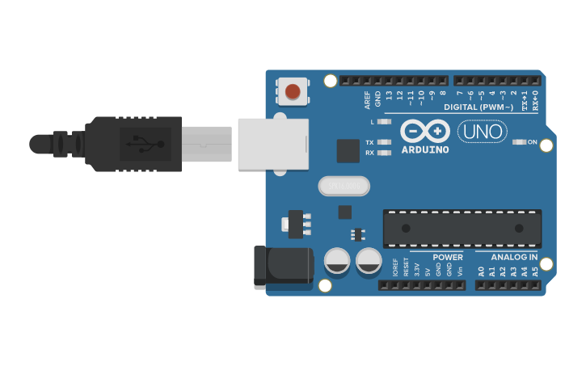

# Info_y_prog_industrial
__UNLZ - FI__   
__Alumno:__ Daniel Antonio Lorenzo 

__Descripción:__ prácticas realizadas por mi durante el curso de informática y programación industrial en UNLZ - FI.   
Se ofrece libremente, sin garantía.

## índice

### Guías de ejercicios
Unidad 1
* [Conversión entre sistemas numéricos](https://nbviewer.jupyter.org/github/daniel-lorenzo/Info_y_prog_industrial/blob/main/Guia_1.ipynb)
Unidad 2
* [Algebra de Boole](https://nbviewer.jupyter.org/github/daniel-lorenzo/Info_y_prog_industrial/blob/main/Guia_2.ipynb)
Unidad 3
* [Mapas de Karnaugh](https://nbviewer.jupyter.org/github/daniel-lorenzo/Info_y_prog_industrial/blob/main/Guia_3.ipynb)

### Software libre relacionado

* [Digital](https://github.com/hneemann/Digital)
* [Simulide](https://www.simulide.com)
* [Qucs](http://qucs.sourceforge.net/)